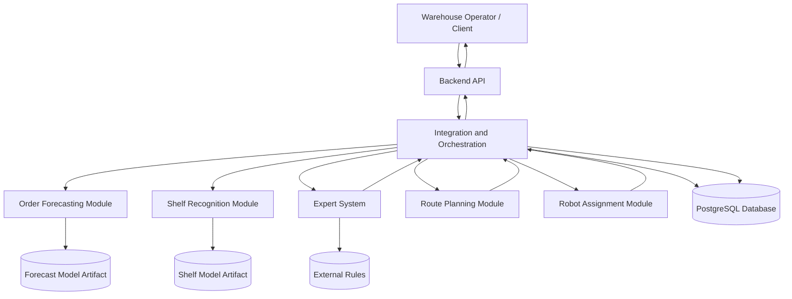
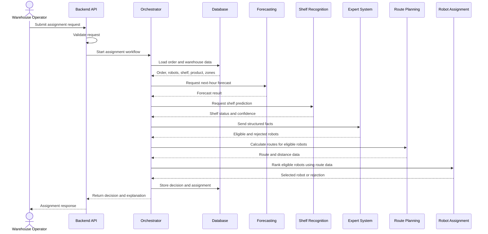

# System Architecture

## Document Information

| Field | Value |
|---|---|
| Project name | Hybrid Intelligent Warehouse System |
| Document version | 0.1 |
| Architecture style | Modular Monolith |
| Team | Abdelrahman and Halit |
| Current phase | Architecture design |

## 1. Architecture Overview

The system will use a modular monolith architecture.

A modular monolith is a single deployable application divided into clearly separated internal modules.

The project will contain the following main modules:

1. Order Forecasting;
2. Shelf Recognition;
3. Expert System;
4. Robot Assignment;
5. Backend API;
6. Database Access;
7. Integration and Orchestration.

Each module will have a clear responsibility and a defined interface.

The modules will run inside one application during the MVP phase.

This architecture was selected because:

- the team contains only two participants;
- the practical-training period is limited;
- the project requires integration between several components;
- deployment and debugging should remain simple;
- module separation is still required;
- the project does not require independent service scaling.

Microservices are excluded from the MVP because they would add unnecessary deployment, networking, and operational complexity.

## 2. Main Components

The system consists of the following main components.

### 2.1 Backend API

The Backend API is the entry point of the system.

Responsibilities:

- receive HTTP requests;
- validate request data;
- call application services;
- return structured responses;
- provide API documentation;
- handle expected errors.

The Backend API will be implemented using FastAPI and Pydantic.

### 2.2 Integration and Orchestration Module

The Integration and Orchestration module coordinates the complete decision process.

Responsibilities:

- load order and warehouse data;
- request a workload forecast;
- request shelf recognition;
- convert module outputs into structured facts;
- call the expert system;
- request robot ranking and route calculation;
- build the final response.

This module does not train machine-learning models and does not contain business rules.

### 2.3 Order Forecasting Module

The Order Forecasting module predicts the expected number of warehouse orders for the next hour.

Responsibilities:

- preprocess time-series data;
- generate forecasting features;
- load the trained forecasting model;
- produce a numeric order forecast;
- classify warehouse load as low, medium, or high;
- return output using the agreed data contract.

Owner:

```text
Abdelrahman
```

### 2.4 Shelf Recognition Module

The Shelf Recognition module classifies the condition of a warehouse shelf from an image.

Responsibilities:

- validate the input image;
- preprocess the image;
- load the trained classification model;
- predict the shelf condition;
- calculate a confidence score;
- return output using the agreed data contract.

Supported classes:

```text
empty
low_stock
normal
full
```

Owner:

```text
Abdelrahman
```

### 2.5 Expert System Module

The Expert System module applies logical rules to warehouse facts.

Responsibilities:

- load warehouse facts;
- represent VSO entities, properties, and relations;
- load logical rules;
- evaluate rule conditions;
- reject unsuitable robots;
- generate logical conclusions;
- record applied rules;
- generate decision explanations.

Owner:

```text
Halit
```

### 2.6 Robot Assignment Module

The Robot Assignment module selects the most suitable eligible robot.

Responsibilities:

- receive eligible robots from the expert system;
- calculate a score for each robot;
- rank candidate robots;
- handle equal scores deterministically;
- select the best robot;
- return ranking details.

Owner:

```text
Halit
```

### 2.7 Route Planning Module

The Route Planning module calculates a route between warehouse zones.

Responsibilities:

- represent warehouse zones as a weighted graph;
- calculate the shortest available route;
- return the route and total distance;
- report when no route is available.

Owner:

```text
Halit
```

### 2.8 Database Access Module

The Database Access module provides controlled access to stored data.

Responsibilities:

- store and retrieve warehouse entities;
- maintain relationships between entities;
- store forecasts and shelf predictions;
- store robot assignments;
- store expert-system rules;
- store decision history;
- manage database transactions.

The planned database technology is PostgreSQL.

Owner:

```text
Halit
```

### 2.9 Model Artifacts

Model artifacts are trained machine-learning files used during prediction.

They include:

- forecasting model files;
- shelf-recognition model files;
- preprocessing configuration;
- class mappings;
- model metadata.

Training code and runtime prediction code must remain separated.

Owner:

```text
Abdelrahman
```

## 3. Data Flow

The system follows a coordinated request-response flow inside the modular monolith.

### 3.1 Main Assignment Flow

The main robot-assignment flow is:

```text
Client or Warehouse Operator
        ↓
Backend API
        ↓
Integration and Orchestration Module
        ↓
Load order, robots, shelf, product, and zone data
        ↓
Request forecast from Order Forecasting Module
        ↓
Request shelf status from Shelf Recognition Module
        ↓
Convert predictions and warehouse data into facts
        ↓
Send facts to Expert System Module
        ↓
Filter unsuitable robots
        ↓
Calculate route information for eligible robots
        ↓
Send eligible robots and route data to Robot Assignment Module
        ↓
Rank robots
        ↓
Select robot or reject assignment
        ↓
Store decision in database
        ↓
Return decision and explanation through Backend API
```

### 3.2 Forecasting Data Flow

The forecasting flow is:

```text
Historical order data
        ↓
Data preprocessing
        ↓
Feature generation
        ↓
Trained forecasting model
        ↓
Expected orders for next hour
        ↓
Load-level classification
        ↓
Structured forecast result
```

The forecasting output must follow the agreed data contract.

Example:

```json
{
  "forecast_time": "2026-07-01T14:00:00",
  "expected_orders": 180,
  "load_level": "high"
}
```

### 3.3 Shelf Recognition Data Flow

The shelf-recognition flow is:

```text
Shelf image
        ↓
Image validation
        ↓
Image preprocessing
        ↓
Trained classification model
        ↓
Predicted shelf status
        ↓
Confidence calculation
        ↓
Structured prediction result
```

Example:

```json
{
  "shelf_id": "S7",
  "status": "low_stock",
  "confidence": 0.91,
  "prediction_time": "2026-07-01T13:55:00"
}
```

### 3.4 Expert-System Data Flow

The expert-system flow is:

```text
Order facts
Robot facts
Shelf facts
Forecast facts
        ↓
Rule evaluation
        ↓
Robot eligibility conclusions
        ↓
Decision constraints
        ↓
Explanation facts
```

The expert system must not directly access raw images or raw historical datasets.

It receives only structured facts from other modules.

### 3.5 Failure and Replanning Flow

The replanning flow is:

```text
Assigned robot changes status to failed
        ↓
Backend receives robot-state update
        ↓
Current assignment is marked as failed
        ↓
Failed robot is excluded
        ↓
Remaining robots are filtered again
        ↓
Robot ranking is repeated
        ↓
New robot is assigned or rejection is returned
        ↓
Updated decision is stored
```

## 4. Component Diagram

The following diagram shows the main system components and their dependencies.



## 5. Module Dependency Rules

The modular monolith must follow controlled dependency rules.

### 5.1 Allowed Dependencies

The following dependencies are allowed:

```text
Backend API
    → Integration and Orchestration

Integration and Orchestration
    → Forecasting
    → Shelf Recognition
    → Expert System
    → Route Planning
    → Robot Assignment
    → Database Access

Expert System
    → Rule Repository

Forecasting
    → Forecast Model Artifact

Shelf Recognition
    → Shelf Model Artifact
```

### 5.2 Forbidden Dependencies

The following dependencies are forbidden:

- the Backend API must not directly access ML model files;
- the Backend API must not contain robot-assignment rules;
- the Forecasting module must not access the Expert System;
- the Shelf Recognition module must not access the database directly;
- the Expert System must not read raw images;
- the Expert System must not read raw historical datasets;
- the Robot Assignment module must not train or load ML models;
- modules must not import internal implementation details from unrelated modules;
- database-specific code must not be placed inside the ML modules.

### 5.3 Communication Rule

Modules shall communicate using defined Python interfaces and validated data objects.

The communication format shall be documented in:

```text
docs/data_contracts.md
```

Modules must exchange structured data rather than unvalidated dictionaries where practical.

### 5.4 Single Responsibility Rule

Each module shall have one primary responsibility:

| Module | Primary responsibility |
|---|---|
| Backend API | HTTP request and response handling |
| Orchestration | Coordination of the complete workflow |
| Forecasting | Order-volume prediction |
| Shelf Recognition | Shelf-image classification |
| Expert System | Logical inference and eligibility decisions |
| Route Planning | Warehouse route calculation |
| Robot Assignment | Candidate ranking and final selection |
| Database Access | Persistent data storage and retrieval |
```

## 6. Runtime Sequence

The following sequence describes how the system processes a robot-assignment request at runtime.



The Orchestration module controls the runtime sequence.

No individual module is allowed to coordinate the entire workflow independently.