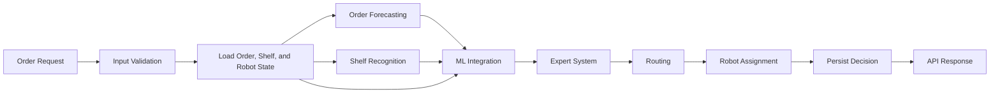
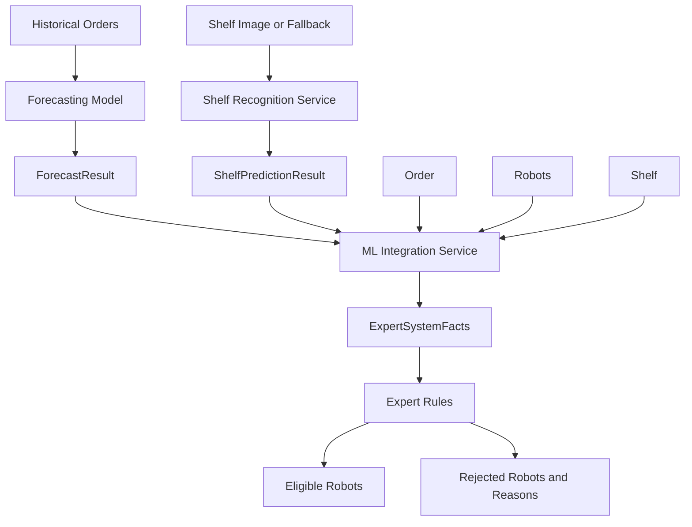
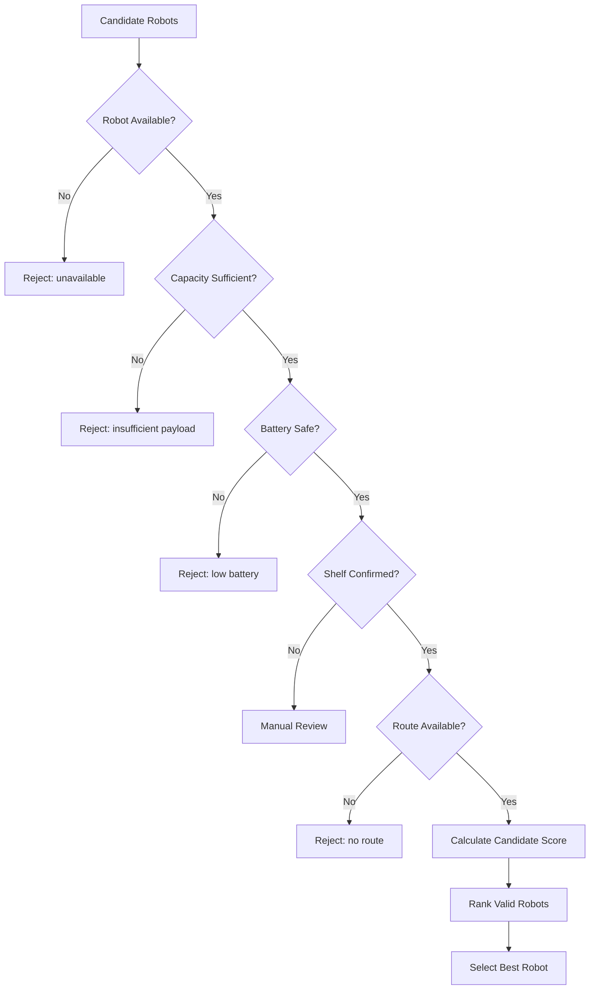
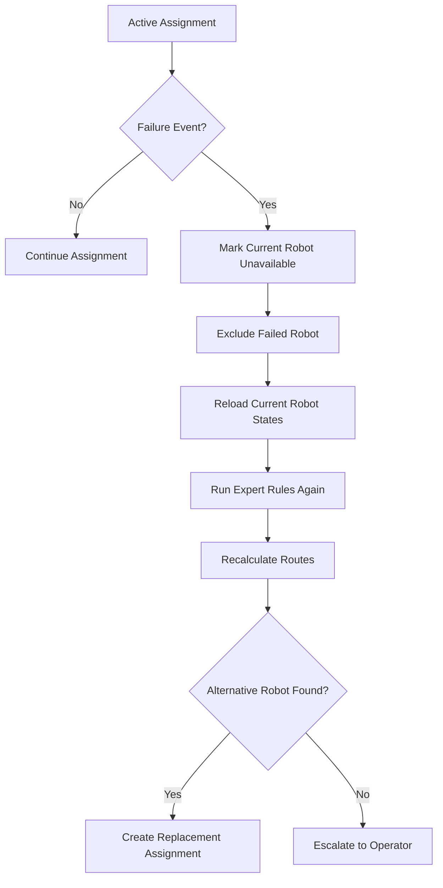
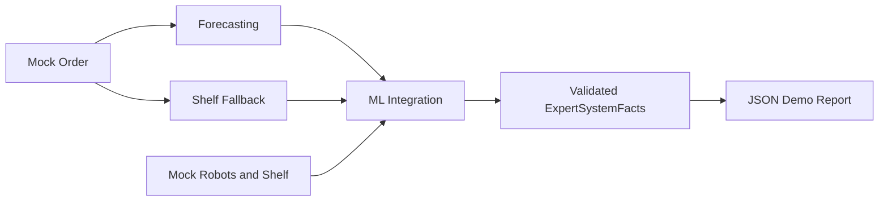

# System Flow

## 1. High-Level Flow



---

## 2. ML-to-Decision Flow



---

## 3. Robot Selection Flow



---

## 4. Replanning Flow



---

## 5. Current Implemented Flow

The current implementation reaches the following point:



The following modules are still expected after this point:

```text
ExpertSystemFacts
→ Expert System
→ Routing
→ Robot Assignment
→ Database
→ API Response
```

---

## 6. Main Data Contracts

### Forecasting Output

```text
ForecastResult
├── forecast_time
├── forecast_horizon_minutes
├── expected_orders
├── load_level
├── model_version
└── generated_at
```

### Shelf Recognition Output

```text
ShelfPredictionResult
├── shelf_id
├── status
├── confidence
├── model_version
├── prediction_time
└── requires_manual_review
```

### Expert-System Input

```text
ExpertSystemFacts
├── order
│   ├── order_id
│   ├── priority
│   ├── total_weight_kg
│   └── shelf_id
├── robots[]
│   ├── robot_id
│   ├── battery_level
│   ├── maximum_load_kg
│   ├── current_zone_id
│   ├── current_workload
│   └── status
├── shelf
│   ├── shelf_id
│   ├── zone_id
│   ├── status
│   ├── confidence
│   └── requires_manual_review
├── forecast
│   ├── expected_orders
│   └── load_level
└── generated_at
```

---

## 7. Module Ownership

### System Analyst / Data Scientist

- requirements;
- data contracts;
- mock scenarios;
- forecasting;
- shelf-recognition interface;
- ML evaluation;
- ML integration;
- limitations;
- end-to-end ML validation.

### Backend / Expert-System Developer

- FastAPI backend;
- database;
- expert-system rules;
- routing;
- assignment;
- replanning;
- persistence;
- operational API responses.

### Shared Responsibilities

- integration;
- end-to-end tests;
- final demo;
- documentation review;
- presentation;
- defense preparation.
